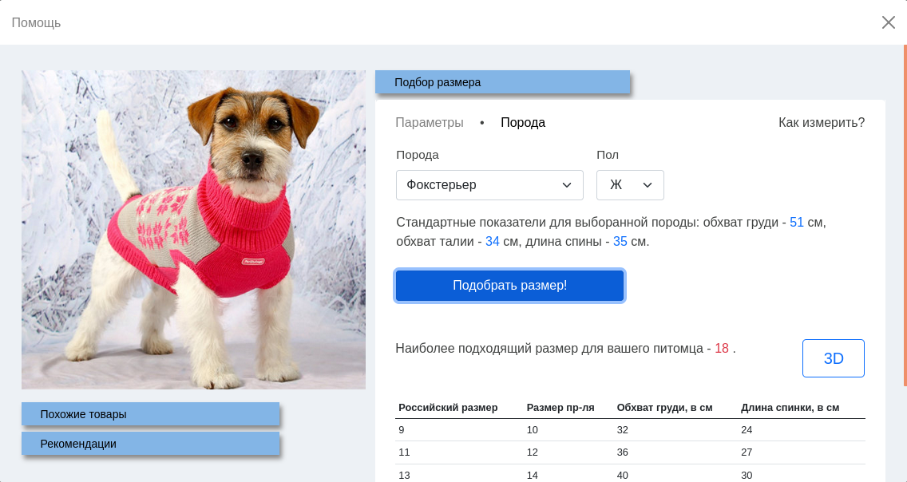

# PetTale

## Информационная система подбора одежды для домашних животных по известным параметрам

Популярность интернет-магазинов возрастает с каждым годом, как и разнообразие предлагаемых товаров, в том числе и одежды. Подбирая вещи онлайн, легко промахнуться даже с своим размером, не говоря уже об одежде для домашних животных, для которой не существует общепринятой размерной сетки. Производители предлагают собственные варианты, учитывающие пол, породу, сезон и множество других параметров, в результате чего у каждой вещи нередко оказывается уникальная система размеров.   
Это усложняет не только выбор нужного размера, но и поиск по каталогу, который, как правило, опирается на предоставленную производителем информацию и оказывается недостаточно эффективным.

В качестве решения данной проблемы предлагается небольшой программный модуль, который может быть добавлен на сайт любого интернет-зоомагазина и который, работая с ассортиментом, может помочь выбрать правильный размер вещи по имеющейся размерной сетке, а также рекомендовать одежду, наиболее подходящую пользователю, с учётом его предпочтений и параметров его питомцев.

## Возможности

- Подбор подходящего размера вещи из имеющейся размерной сетки на основе введённый пользователем параметров;
- Возможность проверить остальные размеры с отображением областей, где выбранный размер не соответствует параметрам;
- Рекомендация наиболее подходящих товаров с фильтрацией по размеру;
- Подбор товаров, похожих на просматриваемый;

  

  

  

  

  
